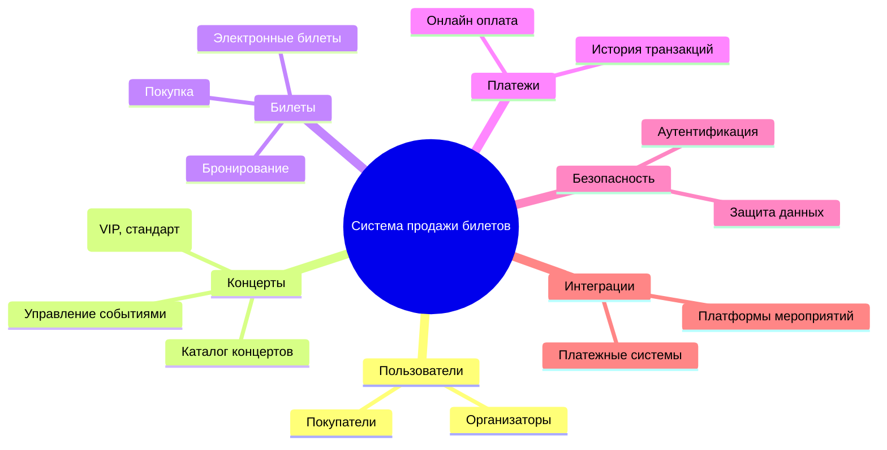
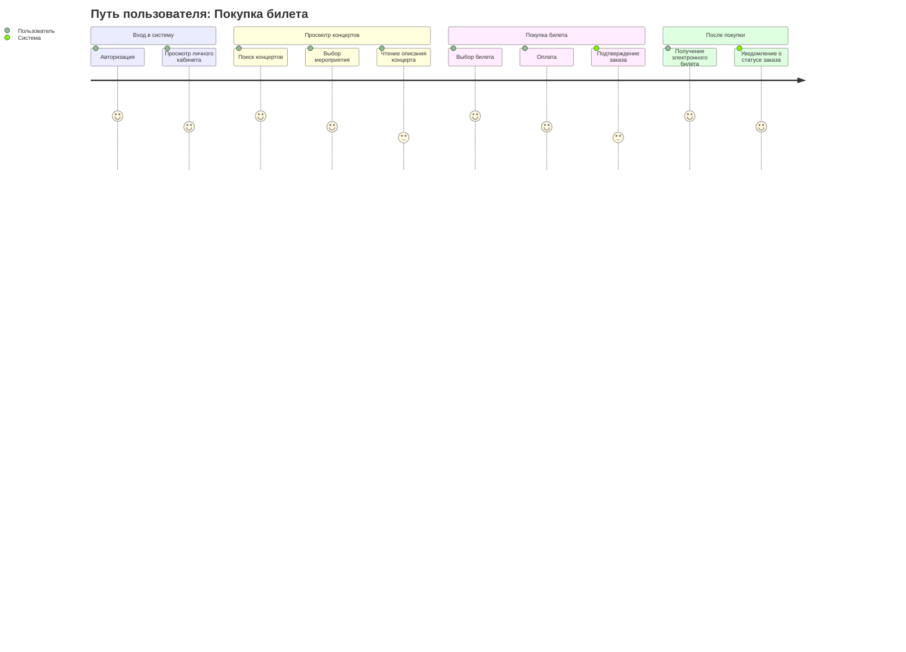
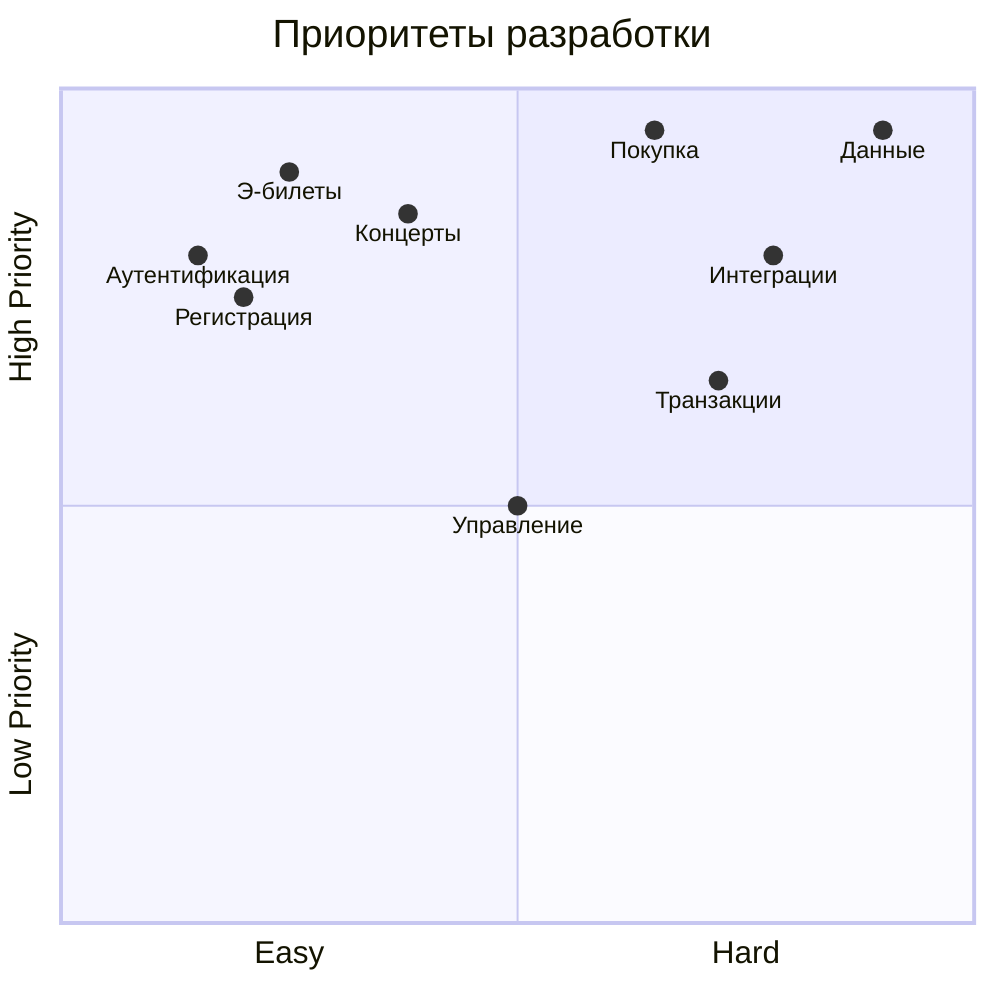
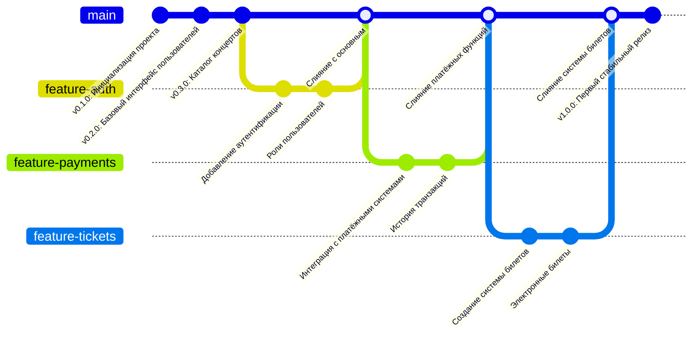

# Документирование приложения для продажи билетов на концерт музыкальной группы

## 1. Структура функциональных возможностей (Mind Map)

# Система продажи билетов на концерты

Этот проект описывает архитектуру и функциональность системы продажи билетов на концерты музыкальных групп. В рамках работы были разработаны диаграммы с использованием **Mermaid** для визуализации структуры и процессов системы.

---

## Диаграмма функциональных возможностей

### Описание:
Пользователи: покупатели и организаторы.
Концерты: управление событиями и их категориями.
Билеты: покупка, бронирование, электронные билеты.
Платежи: онлайн оплата и история транзакций.
Безопасность: аутентификация и защита данных.

## 2. Диаграмма путешествия пользователя (User Journey Diagram)

### Описание:

Пользователь выполняет авторизацию и переходит в личный кабинет.
Выбирает концерт, читает информацию, оформляет билет.
Получает электронный билет и уведомление о заказе.

## 3. Квадрант-граф (Prioritization Quadrant)

### Описание:

Высокий приоритет: покупка билетов, электронные билеты, защита данных.
Средний приоритет: интеграции, транзакции, управление концертами.

## 4. Гит граф (Gitgraph)

### Описание:

Основные ветки: аутентификация, платежи, билеты.
Итоговый релиз: v1.0.0.
